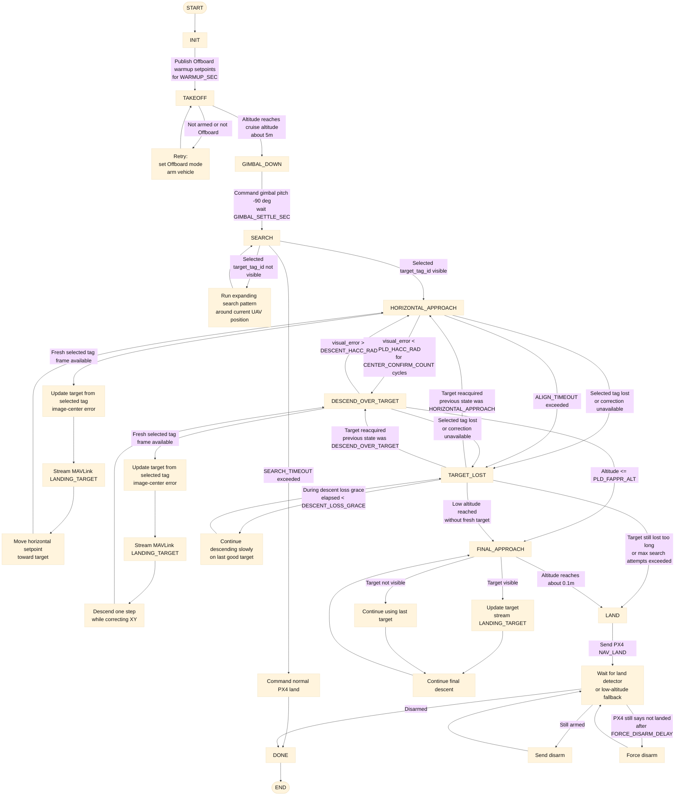

# AprilTag Precision Landing FSM

Open this file in VS Code Markdown preview. Use `Ctrl` + `+` if you want the diagram larger.

```mermaid
%%{init: {
  "theme": "base",
  "themeVariables": {
    "fontSize": "22px",
    "fontFamily": "Arial",
    "primaryTextColor": "#111111",
    "lineColor": "#333333"
  },
  "flowchart": {
    "nodeSpacing": 60,
    "rankSpacing": 80
  }
}}%%

flowchart TD
    A([START]) --> B[INIT]

    B -->|Publish Offboard warmup setpoints<br/>for WARMUP_SEC| C[TAKEOFF]

    C -->|Not armed or not Offboard| C1[Retry:<br/>set Offboard mode<br/>arm vehicle]
    C1 --> C
    C -->|Altitude reaches cruise altitude<br/>about 5m| D[GIMBAL_DOWN]

    D -->|Command gimbal pitch -90 deg<br/>wait GIMBAL_SETTLE_SEC| E[SEARCH]

    E -->|Selected target_tag_id not visible| E1[Run expanding search pattern<br/>around current UAV position]
    E1 --> E

    E -->|Selected target_tag_id visible| F[HORIZONTAL_APPROACH]
    E -->|SEARCH_TIMEOUT exceeded| Z1[Command normal PX4 land]
    Z1 --> Z[DONE]

    F -->|Fresh selected tag frame available| F1[Update target from selected tag<br/>image-center error]
    F1 --> F2[Stream MAVLink LANDING_TARGET]
    F2 --> F3[Move horizontal setpoint<br/>toward target]
    F3 --> F

    F -->|visual_error < PLD_HACC_RAD<br/>for CENTER_CONFIRM_COUNT cycles| G[DESCEND_OVER_TARGET]

    F -->|Selected tag lost<br/>or correction unavailable| L[TARGET_LOST]
    F -->|ALIGN_TIMEOUT exceeded| L

    G -->|Fresh selected tag frame available| G1[Update target from selected tag<br/>image-center error]
    G1 --> G2[Stream MAVLink LANDING_TARGET]
    G2 --> G3[Descend one step<br/>while correcting XY]
    G3 --> G

    G -->|visual_error > DESCENT_HACC_RAD| F
    G -->|Selected tag lost<br/>or correction unavailable| L
    G -->|Altitude <= PLD_FAPPR_ALT| H[FINAL_APPROACH]

    L -->|Target reacquired<br/>previous state was HORIZONTAL_APPROACH| F
    L -->|Target reacquired<br/>previous state was DESCEND_OVER_TARGET| G

    L -->|During descent loss grace<br/>elapsed < DESCENT_LOSS_GRACE| L1[Continue descending slowly<br/>on last good target]
    L1 --> L

    L -->|Low altitude reached<br/>without fresh target| H
    L -->|Target still lost too long<br/>or max search attempts exceeded| I[LAND]

    H -->|Target visible| H1[Update target<br/>stream LANDING_TARGET]
    H -->|Target not visible| H2[Continue using last target]
    H1 --> H3[Continue final descent]
    H2 --> H3
    H3 --> H

    H -->|Altitude reaches about 0.1m| I[LAND]

    I -->|Send PX4 NAV_LAND| I1[Wait for land detector<br/>or low-altitude fallback]
    I1 -->|Still armed| I2[Send disarm]
    I2 --> I1
    I1 -->|PX4 still says not landed<br/>after FORCE_DISARM_DELAY| I3[Force disarm]
    I3 --> I1
    I1 -->|Disarmed| Z[DONE]

    Z --> END([END])
```
