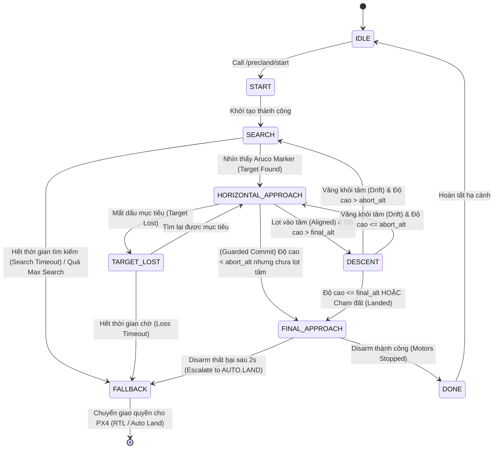

# Sơ đồ Máy trạng thái (FSM) - Precision Landing

Dưới đây là lưu đồ luồng hoạt động (Flow Diagram) của State Machine bên trong `offboard_precland_controller.cpp`. Sơ đồ được vẽ bằng Mermaid, hiển thị trực quan các trạng thái và điều kiện chuyển đổi.

### Giải thích các Nhánh rẽ chính:
1. **Trục chính (Happy Path):** 
   `START` → `SEARCH` → `HORIZONTAL_APPROACH` (Căn giữa) → `DESCENT` (Vừa hạ vừa bám) → `FINAL_APPROACH` (Rơi mù) → `DONE`.
2. **Nhánh An toàn (Failsafe - Abort Alt):**
   - Đang hạ (`DESCENT`) mà bị gió tạt bay ra khỏi tâm:
     - Nếu còn cao (Z > `abort_alt`): Vọt lên `SEARCH` tìm lại.
     - Nếu đã sát đất (Z <= `abort_alt`): Chấp nhận rủi ro, trả về `HORIZONTAL_APPROACH` để ráng căn giữa rồi đáp, tuyệt đối không vọt lên nữa.
3. **Nhánh Kẹt (Fallback):**
   - Khi tìm mục tiêu quá số lần cho phép (`max_search`) hoặc thời gian chờ quá lâu.
   - Khi đã hạ cánh chạm đất nhưng lệnh Disarm thất bại (Delay 2s).
   - Chuyển quyền cho PX4 (gọi RTL hoặc AUTO.LAND tùy cấu hình).
